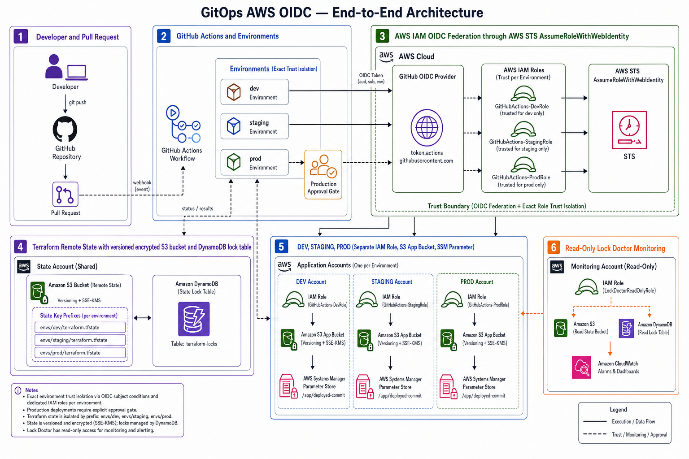
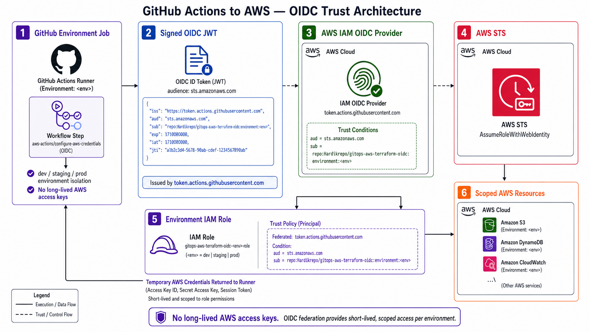

# GitOps for AWS with GitHub OIDC

[](https://developer.hashicorp.com/terraform)
[](https://registry.terraform.io/providers/hashicorp/aws/latest)
[](#identity-and-trust-model)
[](#environment-promotion)

Production-oriented GitOps foundation for provisioning AWS infrastructure with Terraform and GitHub Actions. GitHub jobs obtain short-lived AWS credentials through OpenID Connect (OIDC), so the repository does not store long-lived `AWS_ACCESS_KEY_ID` or `AWS_SECRET_ACCESS_KEY` credentials.

## Key capabilities

- Exact repository-and-environment OIDC trust conditions.
- Separate least-privilege IAM roles for `dev`, `staging`, and `prod`.
- Sequential promotion from development to production.
- Versioned, encrypted Terraform state in Amazon S3.
- Terraform state locking with Amazon DynamoDB.
- GitHub Environment approval gates for sensitive environments.
- AI-assisted Terraform plan review and stale-lock diagnosis.
- Human-approved state-lock remediation.

> [!IMPORTANT]
> The Terraform source is authoritative. The current implementation uses one AWS account, SSE-S3 (`AES256`), a shared state bucket, a shared DynamoDB lock table, and GitHub Issues for lock alerts. Separate workload accounts, customer-managed KMS keys, and CloudWatch alerting visible in presentation artwork are enterprise evolution options, not currently deployed resources.

## Architecture

### End-to-end GitOps architecture



1. A developer opens or updates a pull request.
2. GitHub Actions creates environment-specific jobs.
3. Each job requests a signed OIDC token from GitHub.
4. AWS STS validates the token through the AWS IAM OIDC provider.
5. The job assumes only the IAM role assigned to its GitHub Environment.
6. Terraform reads its environment state and acquires a DynamoDB lock.
7. Approved changes are promoted through `dev`, `staging`, and `prod`.
8. The deployed commit SHA is recorded in AWS Systems Manager Parameter Store.

### OIDC trust architecture



GitHub Actions calls `sts:AssumeRoleWithWebIdentity`. AWS accepts the request only when both token conditions match:

```text
aud = sts.amazonaws.com
sub = repo:Hardikrepo/gitops-aws-terraform-oidc:environment:<environment>
```

For production, the exact subject is:

```text
repo:Hardikrepo/gitops-aws-terraform-oidc:environment:prod
```

The resulting credentials are temporary and inherit only the assumed role's permissions.

## Current AWS resources

| Component | Purpose | Controls |
|---|---|---|
| AWS IAM OIDC provider | Establishes GitHub as a federated identity provider | Audience restricted to `sts.amazonaws.com` |
| Environment IAM roles | Deployment identities for `dev`, `staging`, and `prod` | Exact GitHub subject and namespaced permissions |
| Lock-monitor IAM role | Unattended lock inspection | `dynamodb:GetItem` + `bedrock:InvokeModel` on one model, nothing else |
| Amazon S3 state bucket | Shared Terraform backend | Versioning, SSE-S3, public-access block, `force_destroy = false` |
| Amazon DynamoDB table | Terraform state locking | `LockID` partition key and on-demand billing |
| Environment S3 buckets | Demonstration application workload | Versioning, SSE-S3, and public-access block |
| Systems Manager parameters | Records the deployed commit | Environment-namespaced parameter path |

The current workload does not deploy a VPC, subnet, NAT gateway, load balancer, or compute service. Its AWS services do not require a workload VPC.

## Repository structure

```text
gitops-aws-oidc/
├── .github/workflows/
│   ├── terraform-plan.yml       # PR validation, plan, and risk review
│   ├── terraform-apply.yml      # Sequential dev → staging → prod apply
│   ├── lock-doctor.yml          # Scheduled read-only lock diagnosis
│   └── unlock-approved.yml      # Manual, approved force-unlock
├── agents/
│   ├── plan-reviewer/           # AI-assisted plan assessment
│   └── lock-doctor/             # Lock detection and issue creation
├── bootstrap/                   # One-time trust and backend foundation
├── envs/
│   ├── dev/
│   ├── staging/
│   └── prod/
├── modules/
│   ├── app-stack/               # S3 and deployed-commit workload
│   └── oidc-role/               # Environment role/policy factory
└── docs/architecture/           # Architecture documentation
```

## Identity and trust model

Each environment role has two independent protections:

1. **Trust isolation:** only tokens from the expected repository and GitHub Environment are accepted.
2. **Permission isolation:** the role can access only its state prefix and environment-namespaced resources.

| Environment | OIDC subject suffix | State key | Resource namespace |
|---|---|---|---|
| `dev` | `environment:dev` | `envs/dev/terraform.tfstate` | `gitops-aws-oidc-dev-*` |
| `staging` | `environment:staging` | `envs/staging/terraform.tfstate` | `gitops-aws-oidc-staging-*` |
| `prod` | `environment:prod` | `envs/prod/terraform.tfstate` | `gitops-aws-oidc-prod-*` |

Environment roles can read/write their state, list their permitted S3 prefix, operate the lock item, manage namespaced application buckets, manage namespaced Systems Manager parameters, and invoke one Bedrock model (used by the plan-reviewer agent during `terraform-plan.yml`).

## Delivery workflows

### Pull-request plan

`terraform-plan.yml` runs for relevant pull-request changes. For each environment it:

1. Assumes the environment IAM role through OIDC.
2. Initializes the S3 backend.
3. Runs `terraform fmt -check -recursive` and `terraform validate`.
4. Creates the Terraform plan.
5. Converts the plan to JSON and runs the AI-assisted plan reviewer.
6. Posts an informational risk assessment to the pull request.

The reviewer highlights deletions, replacements, and security-sensitive changes. It supports human review and does not replace approval controls.

### Environment promotion

`terraform-apply.yml` runs after relevant changes reach `main`:

```text
main → dev apply → staging apply → production approval → prod apply
```

The workflow uses `max-parallel: 1`. Configure required reviewers on the GitHub `prod` Environment to enforce the production gate.

## First-time bootstrap

Bootstrap runs locally because CI cannot assume an AWS role until the OIDC provider and roles exist.

### Prerequisites

- Terraform 1.7 or newer.
- AWS credentials authorized to create IAM, S3, and DynamoDB resources.
- GitHub repository `Hardikrepo/gitops-aws-terraform-oidc`.
- GitHub Environments named `dev`, `staging`, and `prod`.

### Apply

```bash
aws sts get-caller-identity
cd bootstrap
terraform init
terraform plan
terraform apply
```

Record these outputs:

```text
state_bucket
lock_table
role_arns
lock_monitor_role_arn
```

## GitHub configuration

Create GitHub Environments `dev`, `staging`, and `prod`; add required reviewers to `prod` and optionally `staging`.

| Scope | Type | Name | Value |
|---|---|---|---|
| Each environment | Variable | `AWS_ROLE_ARN` | Matching `role_arns` value |
| Repository | Variable | `AWS_REGION` | `us-east-1` by default |
| Repository | Variable | `TF_STATE_BUCKET` | Bootstrap `state_bucket` output |
| Repository | Variable | `TF_LOCK_TABLE` | Bootstrap `lock_table` output |
| Repository | Variable | `LOCK_MONITOR_ROLE_ARN` | Bootstrap monitor-role output |

No `ANTHROPIC_API_KEY` secret is required. Both AI-assisted agents call Claude
through Amazon Bedrock, authenticated with the same short-lived OIDC-issued
AWS credentials each job already has (`AnthropicBedrockMantle(aws_region=...)`
picks these up automatically) — see `InvokeClaudeViaBedrock` in
`modules/oidc-role/main.tf` and `bootstrap/main.tf`. This does mean Bedrock
model access for `anthropic.claude-sonnet-5` must be enabled for this AWS
account/region in the Bedrock console before either agent's first real call —
that's an AWS-side entitlement, not something Terraform manages.

Workflow permission `id-token: write` permits a job to request an OIDC token; it does not itself grant AWS access.

## Manual environment operation

CI is the normal path. For troubleshooting one environment:

```bash
cd envs/dev

terraform init \
  -backend-config="bucket=<state_bucket>" \
  -backend-config="dynamodb_table=<lock_table>" \
  -backend-config="region=us-east-1"

terraform plan -var="deployed_commit=local-test"
terraform apply -var="deployed_commit=local-test"
```

Manual execution requires suitable AWS credentials.

## State-lock detection and recovery

`lock-doctor.yml` runs every 30 minutes, after plan/apply workflows, and on manual dispatch. It assumes the read-only monitor role and calls only `dynamodb:GetItem`. When a lock appears stale, it correlates the lock with GitHub Actions activity, requests an AI-assisted assessment, and opens or updates a GitHub Issue labeled `state-lock`.

It never deletes a lock automatically.

Approved remediation:

1. Verify that no Terraform process is active.
2. Manually run `unlock-approved.yml`.
3. Select the environment and provide the reported lock ID.
4. Complete the GitHub Environment approval.
5. The workflow runs `terraform force-unlock -force <lock_id>` using the environment role.

> [!WARNING]
> Never force-unlock state while another Terraform process is running. Concurrent state modification can corrupt Terraform state.

## Security characteristics

- No long-lived AWS credentials in GitHub.
- Exact repository and environment conditions in IAM trust policies.
- Short-lived, traceable STS sessions.
- Independent deployment roles per environment.
- Prefix- and namespace-scoped authorization.
- Versioned and non-public Terraform state.
- Automated read-only diagnosis separated from approved mutation.
- Production deployment and unlock operations can share the same reviewer gate.

## Replacing the demo workload

`modules/app-stack` proves the pipeline with an S3 bucket and Systems Manager parameter. Preserve the naming convention when adding production resources:

```text
gitops-aws-oidc-<environment>-*
```

If new resources cannot follow this namespace, deliberately update `modules/oidc-role/main.tf` and review the expanded IAM scope.

## Validation

```bash
terraform fmt -recursive

cd bootstrap
terraform init -backend=false
terraform validate
```

Validate each `envs/<environment>` root after backend initialization.

## License

No license file is currently included. Add an approved license before external distribution or reuse.
